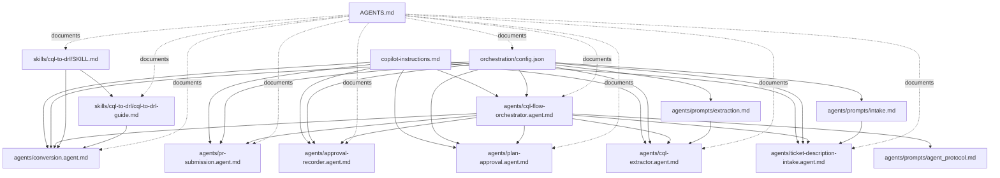

# Agent File Map

This file explains why each major markdown file exists and how the major files connect.

## Flow Diagram

## Why Each Markdown File Exists

| File | Why it exists | Needs config.json |
|---|---|---|
| `.github/copilot-instructions.md` | Workspace-wide operating rules for all agent work. | No |
| `.github/AGENTS.md` | Human-readable map of the file graph so the workflow is understandable and maintainable. | No |
| `.github/agents/cql-flow-orchestrator.agent.md` | Defines the stage order and decides which stage should run next. | Yes |
| `.github/agents/prompts/agent_protocol.md` | Shared contract for how agents read state, write artifacts, and respect guardrails. | Indirectly |
| `.github/agents/ticket-description-intake.agent.md` | Defines how intake turns a ticket into a normalized intake artifact. | Yes |
| `.github/agents/prompts/intake.md` | Minimal intake prompt content referenced by the manifest for the intake stage. | Yes |
| `.github/agents/cql-extractor.agent.md` | Defines how intake output becomes structured extraction output. | Yes |
| `.github/agents/prompts/extraction.md` | Minimal extraction prompt content referenced by the manifest for the extraction stage. | Yes |
| `.github/agents/plan-approval.agent.md` | Defines how a plan is produced and how the approval gate is entered. | Yes |
| `.github/agents/approval-recorder.agent.md` | Defines how explicit human approval is recorded before conversion. | Yes |
| `.github/agents/conversion.agent.md` | Defines how approved extraction output becomes DRL and mapping output. | Yes |
| `.github/agents/pr-submission.agent.md` | Defines how converted output becomes a PR draft and GitHub update. | Yes |
| `.github/skills/cql-to-drl/SKILL.md` | Conversion rulebook used to keep DRL generation consistent and enforce non-negotiable constraints. | No |
| `.github/skills/cql-to-drl/cql-to-drl-guide.md` | Detailed conversion reference used by the conversion stage and mapping output. | No |

## What config.json Is For

`.github/orchestration/config.json` is the runtime manifest.

It exists because the workflow needs one place to define:

- stage order
- which agent file belongs to each stage
- optional prompt modules for stages that use them
- which files each stage writes
- global guardrails
- GitHub repository settings used by PR submission

Without `config.json`, the orchestrator and the stage agents would not have a shared source of truth for sequencing and guardrails.

## Files That Directly Need config.json

These files read or depend on `.github/orchestration/config.json` at runtime:

- `.github/agents/cql-flow-orchestrator.agent.md`
- `.github/agents/ticket-description-intake.agent.md`
- `.github/agents/cql-extractor.agent.md`
- `.github/agents/plan-approval.agent.md`
- `.github/agents/approval-recorder.agent.md`
- `.github/agents/conversion.agent.md`
- `.github/agents/pr-submission.agent.md`
- prompt modules referenced inside `config.json`

## Config References That Matter

`config.json` currently points to these prompt modules:

- `.github/agents/prompts/intake.md`
- `.github/agents/prompts/extraction.md`

Additional shared protocol file:

- `.github/agents/prompts/agent_protocol.md`

## Minimal Dependency Rules

- All stage agents depend on `copilot-instructions.md` for workspace rules.
- All runtime stages depend on `config.json` for sequencing and guardrails.
- The orchestrator depends on `agent_protocol.md` for shared behavior.
- The conversion stage depends on both `SKILL.md` and `cql-to-drl-guide.md`.
- Intake and extraction are the only stages currently using prompt modules from config.

## Runtime Guide

Detailed run flow, exact commands, MCP startup location, and stage-by-stage verification are in:

- `docs/runtime-flow.md`
