# Architecture: Local Multi-Agent CQL to DRL Pipeline

## Overview

The workflow is intentionally split into specialist agents with strict stage boundaries.

1. Intake Agent: ticket and metadata retrieval
2. Extractor Agent: CQL parse and semantic extraction
3. Plan Agent: plan creation plus human approval checkpoint
4. Conversion Agent: CQL to DRL transformation
5. PR Agent: PR-ready documentation and checks

## Why This Split

- Better auditability and easier troubleshooting
- Reduced context pressure per agent
- Clear ownership of intermediate artifacts

## Data Flow

- Input: ADO ticket id
- Intermediate: JSON/Markdown artifacts per stage
- Output: DRL files (one per changed CQL), mapping notes, PR draft text

## DRL Modeling Standard

- Conversion output fact modeling must mirror reference DRLs in `examples/drl-reference/year2026/`.
- Prefer platform domain facts (`Program`, `Patient`, `ClinicalActivity`, `EncounterDenominator`, etc.) over synthetic wrapper records.
- Restrict `declare` usage to marker/helper state facts needed for dedup or source splitting.

## Approval Gate

No conversion may start until `state/approval-status.json` is set to:

{
  "ticketId": "<ticket-id>",
  "approved": true,
  "approvedBy": "<name>",
  "approvedAt": "<iso-8601>"
}

## Local First Strategy

This scaffold is local-first. Webhooks and CI agents are deferred until local examples validate quality and reliability.

---

## Agent Execution Flow

```mermaid
flowchart TD
    START(["User: populate state/run-input.json\nwith ticketUrl"])
    START --> O

    O["fa:fa-sitemap /cqlFlowOrchestrator\nReads pipeline-status.json\nRecommends next valid agent"]
    O --> A

    subgraph STAGE1["Stage 1 — Intake"]
        A["/ticketDescriptionIntakeAgent\nFetches ADO ticket via MCP\nExtracts PR links and CQL paths\nResolves source branch + commit"]
        A --> A_OUT["artifacts/intake/&lt;id&gt;.json\npipeline: intake-complete"]
    end

    A_OUT --> B

    subgraph STAGE2["Stage 2 — Extraction"]
        B["/cql-extractor\nFetches CQL from PR source branch\nExtracts definitions, value sets,\nclauses, and dependencies"]
        B --> B_OUT["artifacts/extraction/&lt;id&gt;.json\npipeline: extraction-complete"]
    end

    B_OUT --> C

    subgraph STAGE3["Stage 3 — Plan + Approval Gate"]
        C["/plan-approval\nBuilds implementation plan\nHighlights risks and unknowns\nSets approved: false"]
        C --> C_OUT["artifacts/plan/&lt;id&gt;.md\napproval-status.json approved=false\npipeline: awaiting-approval"]
        C_OUT --> HUMAN{{"HUMAN REVIEW\nRead plan · verify assumptions\nDecide to approve or revise"}}
        HUMAN -->|"approve"| D
        HUMAN -->|"revise"| C
    end

    subgraph STAGE4["Stage 4 — Record Approval"]
        D["/approvalRecorder\nUser provides approver name + note\nSets approved: true with timestamp"]
        D --> D_OUT["approval-status.json approved=true\npipeline: conversion-ready"]
    end

    D_OUT --> E

    subgraph STAGE5["Stage 5 — Conversion"]
        E["/conversion\nValidates approval gate\nGenerates DRL per changed CQL\nRuns validate_conversion_artifacts.py"]
        E --> E_OUT["artifacts/conversion/mipsNNN.drl\nartifacts/conversion/&lt;id&gt;-mapping.md\npipeline: conversion-complete"]
    end

    E_OUT --> F

    subgraph STAGE6["Stage 6 — PR Submission"]
        F["/pr-submission\nCreates GitHub branch\nPushes DRL files via GitHub MCP\nOpens GitHub PR"]
        F --> F_OUT["artifacts/pr/&lt;id&gt;-pr.md\nGitHub PR created\npipeline: pr-ready"]
    end

    F_OUT --> DONE(["Done"])

    style HUMAN fill:#ffe599,stroke:#f0b429,color:#333
    style O fill:#d9ead3,stroke:#6aa84f
    style START fill:#cfe2f3,stroke:#3d85c8
    style DONE fill:#cfe2f3,stroke:#3d85c8
```

### Orchestrator and Human Intervention

The `/cqlFlowOrchestrator` is a **routing guide**, not an automatic executor. It reads `state/pipeline-status.json` and recommends the next valid slash command — it does not auto-chain agents.

**Mandatory human touch-points (by design):**

| Touch-point | Why it cannot be automated |
|---|---|
| Populate `state/run-input.json` | User must supply the ADO ticket URL to start the run |
| Invoke each slash agent | User types `/agentName` in chat to advance each stage |
| Plan review (Stage 3 hard stop) | Core Rule 1: conversion is blocked until a named human explicitly approves |
| Provide approver name to `/approvalRecorder` | Ensures a traceable, non-automated approval identity |

**Net result:** Stages 1, 2, 5, and 6 are fully automated once launched. Stage 4 requires only pasting an approver name. Stage 3 is the one genuine human decision point. If you want fully automated chaining (with a single approval pause), the orchestrator would need to be extended to call `runSubagent` internally — that is a future enhancement flagged in `docs/todo.md`.
